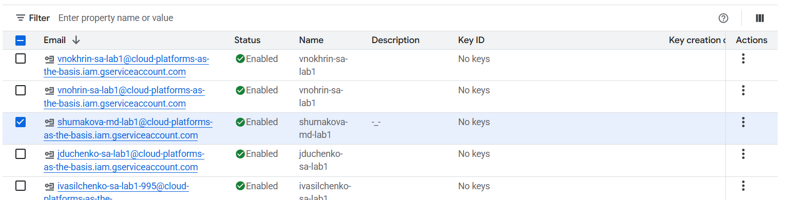
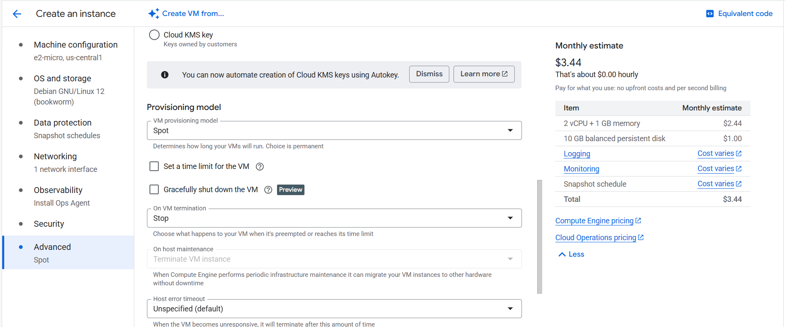
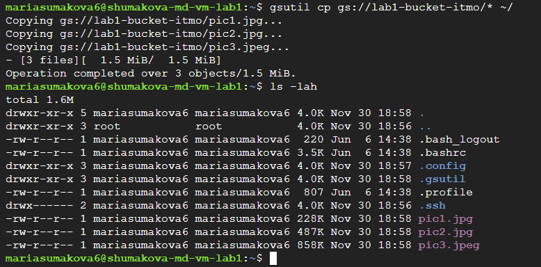
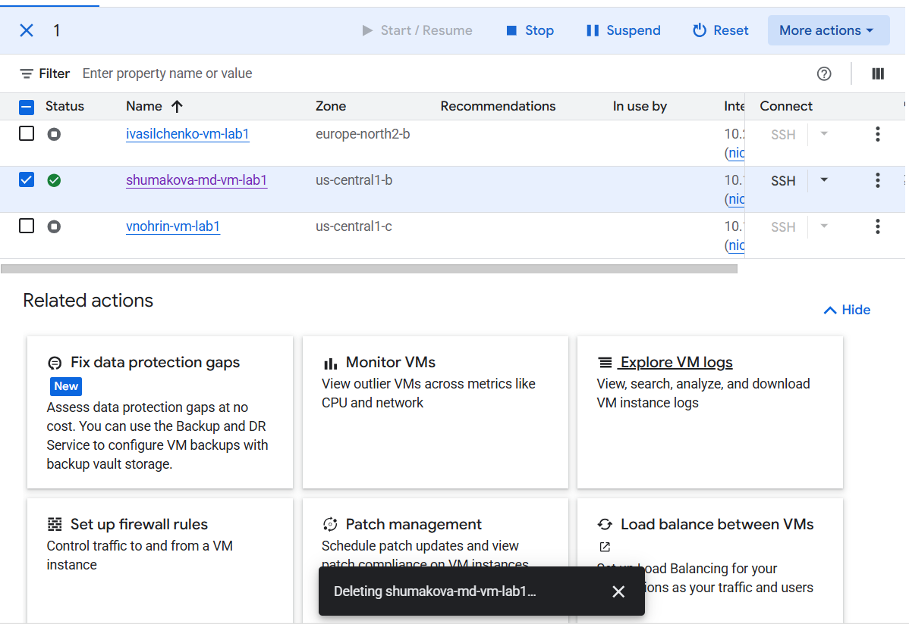

### Лабораторная работа №1
University: ITMO University  
Faculty: FICT  
Course: SA  
Year: 2025  
Group: U4225  
Author: Шумакова Мария Денисовна  
Lab: Lab1  
Date of create: 30.11.2025  
Date of finished: 30.11.2025

---

1. Создание сервисного аккаунта во вкладке IAM с правами Storage admin

2. Создание минимальной compute engine (виртуальной машины) с Machine type e2-micro в режиме spot.

3. С помощью утилиты gsutils нашла бакет lab1-bucket-itmo и скопировала 3 файла в локальную папку на VM. Использовала команду ls -lah и отобразила, что эти файлы хранятся у меня на VM.  

4. Поменяла права доступа для service account с Storage Admin на Compute Viewer, попробовала повторить пункт с копированием данных, сделала выводы. 

5. Удалила за собой все созданные сервисы.

