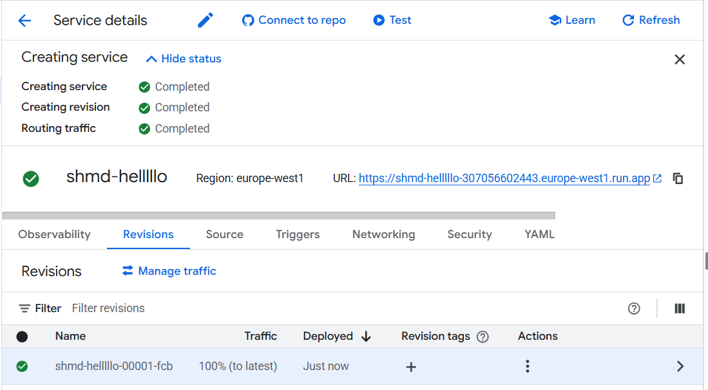
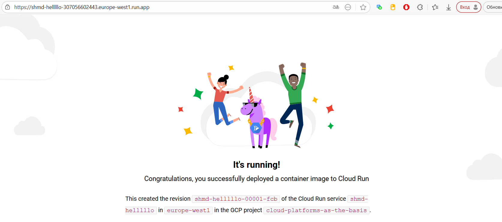
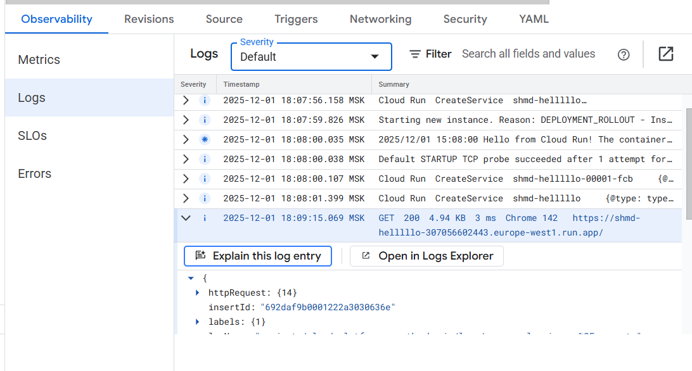
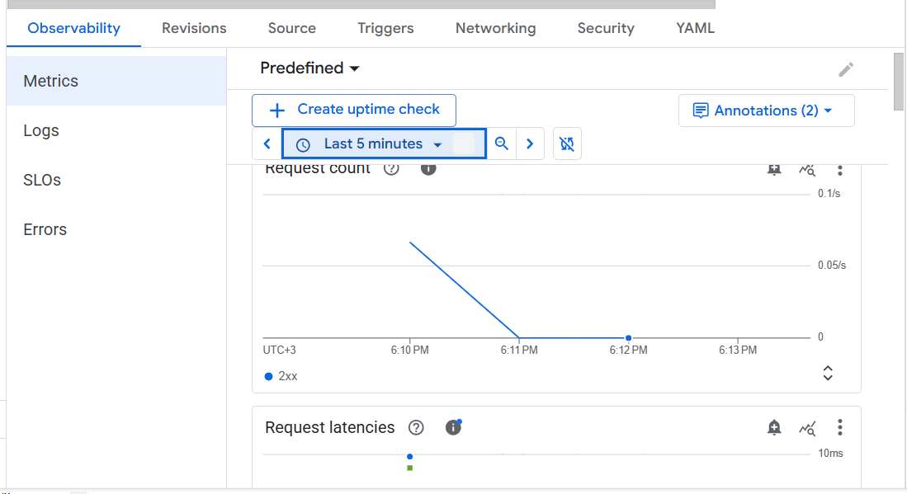
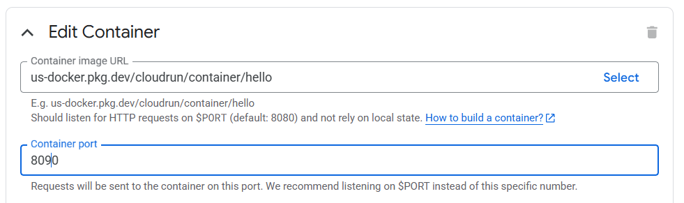
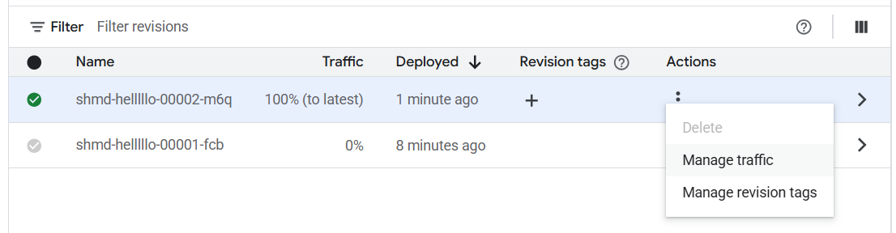
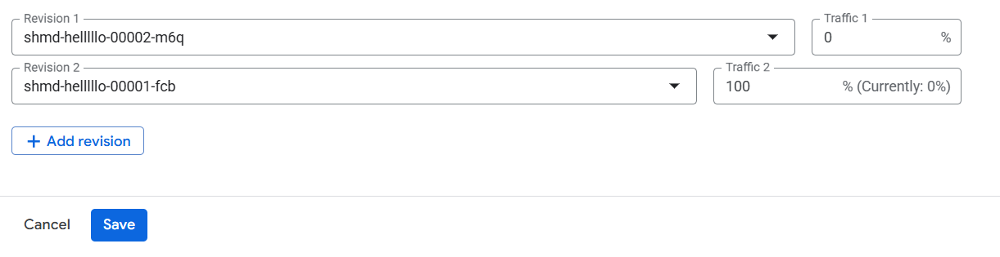

### Лабораторная работа №2
University: ITMO University  
Faculty: FICT  
Course: SA  
Year: 2025  
Group: U4225  
Author: Шумакова Мария Денисовна  
Lab: Lab2  
Date of create: 1.12.2025  
Date of finished: 1.12.2025

---

1. Создала Cloud Run из представленного дефолтного сервиса Hello с минимальным количеством ресурсов.

2. Перешла по ссылке предоставленной Cloud Run, и посмотрела на результат.

3. Перешла в раздел "логи", затем в "метрики"

в логах можно увидеть:

- входящие HTTP-запросы
- время обработки
- информацию о создании ревизий  

В метриках (за последние 5 минут т.к. сервис только запущен):
- количество запросов  
- время отклика  

сервис продолжил работать корректно и не выдал ошибку.

Причина: Cloud Run использует переменную окружения PORT=8080, и образ gcr.io/cloudrun/hello всегда слушает именно этот порт, игнорируя порт, указанный вручную в настройках UI.

5. Переключение трафика между ревизиями

В сервисе выбрала вкладку Revisions. Создала 2 ревизии с портами 8080 и 8090

Через Manage traffic распределяла трафик между ними.

