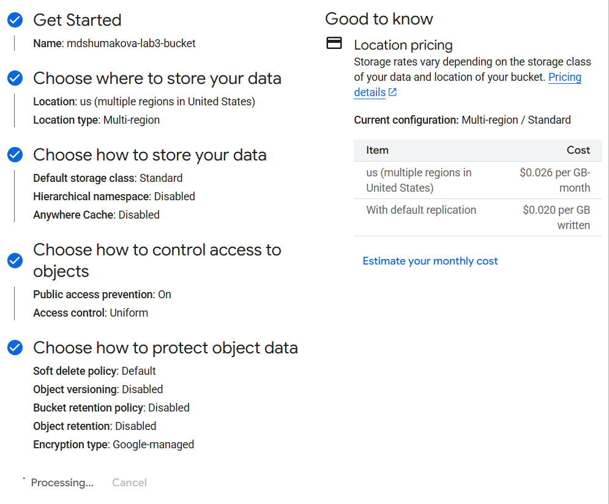
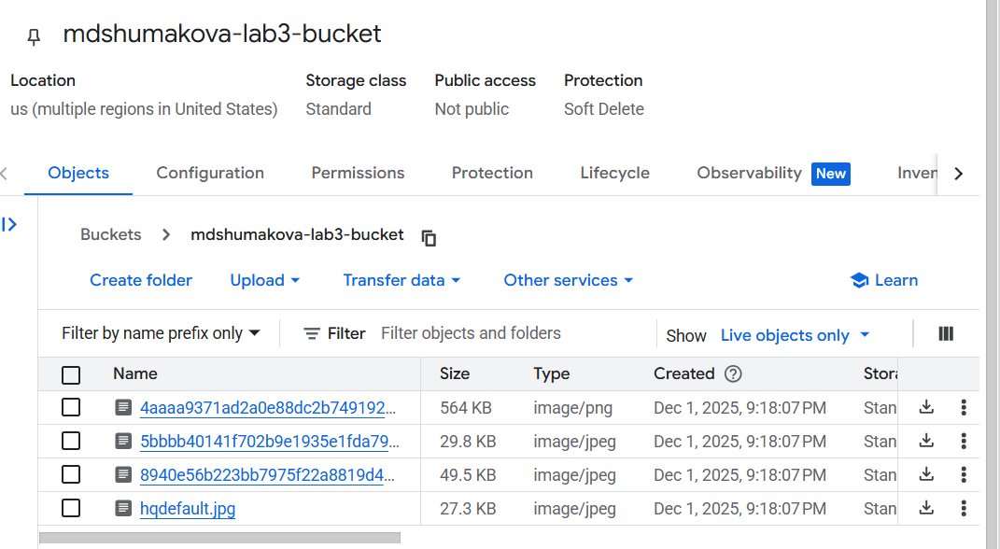
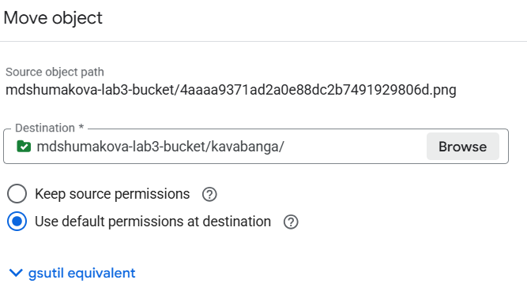
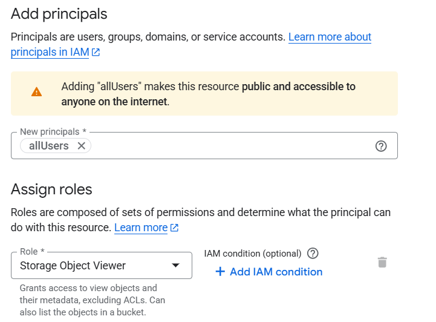
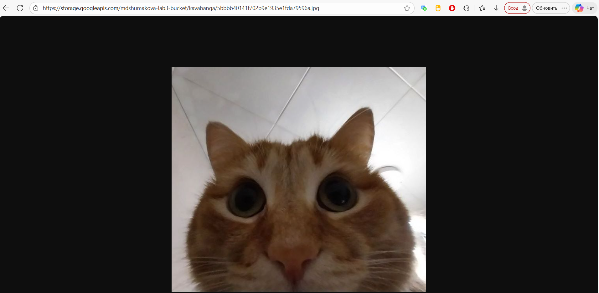
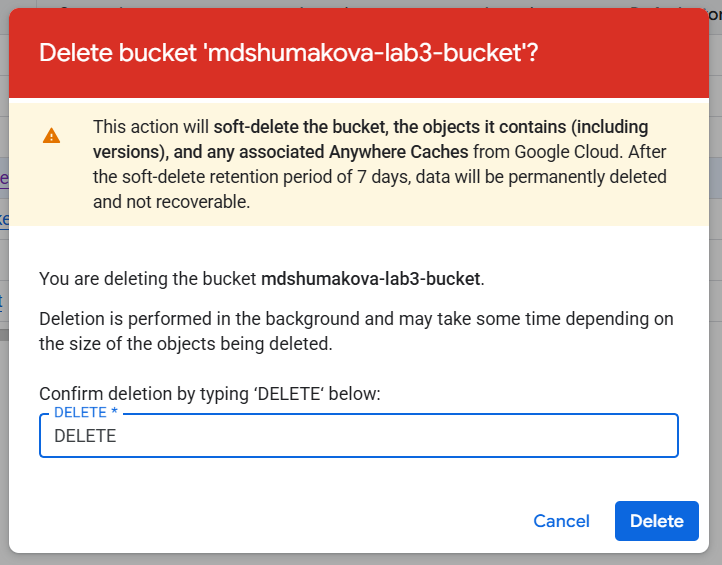

### Лабораторная работа №3
University: ITMO University  
Faculty: FICT  
Course: SA  
Year: 2025  
Group: U4225  
Author: Шумакова Мария Денисовна  
Lab: Lab3  
Date of create: 1.12.2025  
Date of finished: 1.12.2025

---
1. Выбрала существующий проект  

2. Создала Cloud Storage bucket  

3. Загрузила 4 изображения мемов с котиками в Cloud Storage bucket.  

4. Создала папку с названием kavabanga и переместила туда файлы.  

5. Настроила публичный доступ для файлов в настройках приватности

6. Создала ссылку на файлы через контекстное меню файла (из-за следующего пункта они не работают):
- https://storage.googleapis.com/mdshumakova-lab3-bucket/kavabanga/4aaaa9371ad2a0e88dc2b7491929806d.png
- https://storage.googleapis.com/mdshumakova-lab3-bucket/kavabanga/5bbbb40141f702b9e1935e1fda79596a.jpg
- https://storage.googleapis.com/mdshumakova-lab3-bucket/kavabanga/8940e56b223bb7975f22a8819d4d5866.jpg
- https://storage.googleapis.com/mdshumakova-lab3-bucket/kavabanga/hqdefault.jpg  

7. Удалила за собой все созданные сервисы  

