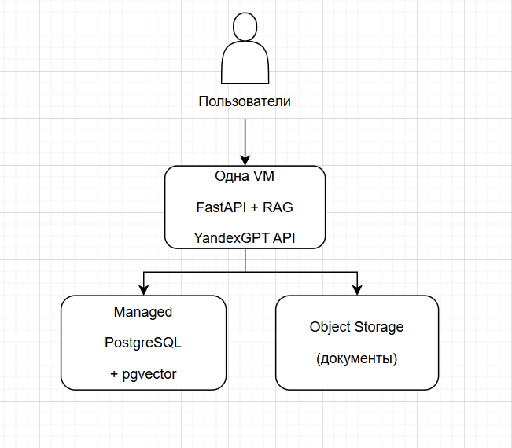
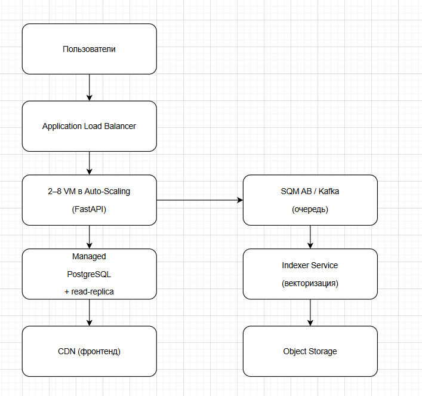
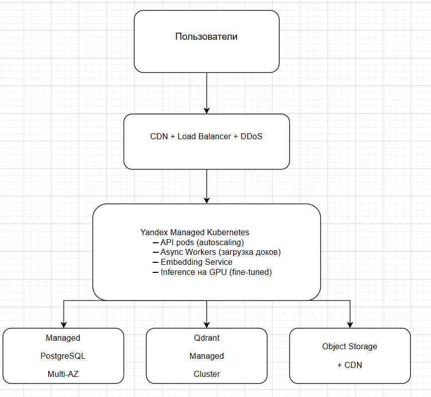

# Лабораторная работа №4 
University: ITMO University  
Faculty: FICT  
Course: SA  
Year: 2025  
Group: U4225  
Author: Шумакова Мария Денисовна  
Lab: Lab4  
Date of create: 2.12.2025  
Date of finished: 2.12.2025  

---

### Описание приложения  

DocuMind — AI-ассистент, который отвечает на вопросы сотрудников по внутренней проектной документации (Confluence, Notion, PDF, Google Docs).  
Функции:  
Загрузка документов  
Поиск по смыслу  
Ответы на вопросы через RAG (Retrieval-Augmented Generation)  
История запросов  

**Стек**: Python + FastAPI, Yandex Cloud  
Три стадии развития:  
1. **MVP**  
Пользователей одновременно: 5–25  
Запросов в день: до 300  
Стоимость в месяц: 10–15 $  
Что используем (Yandex Cloud): Одна маленькая VM + всё в одном контейнере  

2. **Тестирование партнёрами**  
Пользователей одновременно: 50–400  
Запросов в день: 2 000 – 8 000  
Стоимость в месяц: 110–150 $  
Что используем (Yandex Cloud): Балансировщик + несколько VM + очередь  

3. **Продакшн**
Пользователей одновременно: 800–2000+  
Запросов в день: 30 000 – 100 000  
Стоимость в месяц: 950–1100 $  
Что используем (Yandex Cloud): Managed Kubernetes + GPU + отказоустойчивость  

### Схемы инфраструктуры (draw.io)  

Схема 1 — MVP (самое простое):  

Схема 2 — Тестирование партнёрами:

Схема 3 — Продакшн:

  

### Стоимость (подробно, Yandex Cloud, декабрь 2025)  

**MVP:**  
VM / Kubernetes + GPU: 1 VM (~20$)  
Managed PostgreSQL + pgvector: ~12$  
Qdrant Managed: —  
Load Balancer + DDoS: —  
Object Storage + CDN: ~3$  
Очередь (Kafka): —  
YandexGPT API + собственная модель: ~8–12$  
Мониторинг, логи: ~3$  
Итого в месяц: 10–15 $  

**Тестирование партнёрами:**  
VM / Kubernetes + GPU: до 8 VM (~100$)  
Managed PostgreSQL + pgvector: ~80$  
Qdrant Managed: —  
Load Balancer + DDoS: ~30$  
Object Storage + CDN: ~10$  
Очередь (Kafka): ~20$  
YandexGPT API + собственная модель: ~90–130$  
Мониторинг, логи: ~10$  
Итого в месяц: 110–150 $  

**Продакшн:**  
VM / Kubernetes + GPU: K8s + GPU (~500$)  
Managed PostgreSQL + pgvector: ~250$  
Qdrant Managed: ~150$  
Load Balancer + DDoS: ~70$  
Object Storage + CDN: ~30$  
Очередь (Kafka): ~40$  
YandexGPT API + собственная модель: ~600–800$  
Мониторинг, логи: ~40$  
Итого в месяц: 950–1100 $  

### Обоснование выбора

MVP — всё на одной VM: быстро запустили, почти бесплатно.  
Как только пошли партнёры — добавили балансировщик и autoscaling, чтобы не падало.  
В продакшене — перешли на Kubernetes и GPU, потому что внешний YandexGPT при 100 000 запросов в день стал бы стоить 3000$+, а своя fine-tuned модель на GPU снижает стоимость ответа в 7–10 раз.